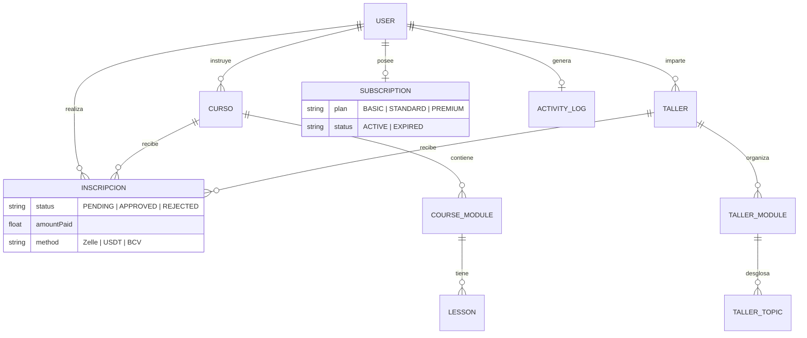
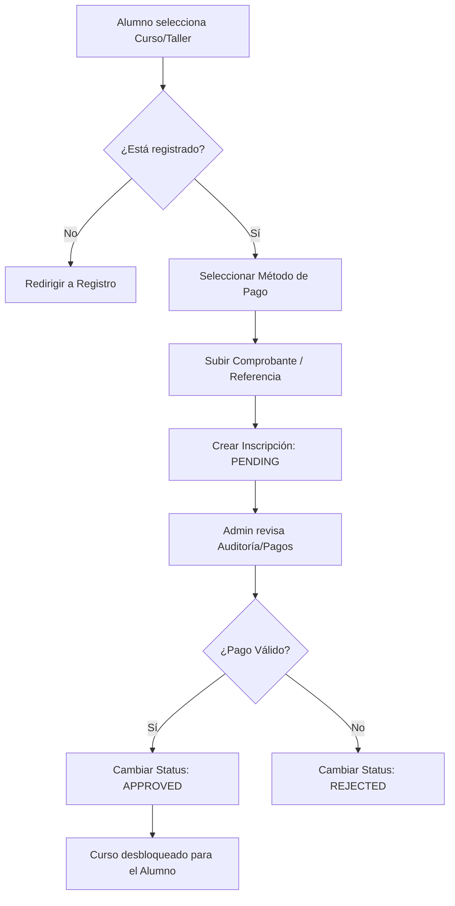

# Arquitectura y Flujo de Datos - ARTICADEMY

Este documento detalla la estructura de la base de datos (ERD) y los flujos lógicos principales de la plataforma.

## 1. Diagrama de Entidad Relación (ERD)

A continuación se muestra la estructura actual de las tablas y sus conexiones.

---

## 2. Flujo Lógico de Inscripción

El siguiente proceso describe cómo un Alumno accede a un curso o taller:

---

## 3. Lógica de Suscripciones vs Pagos Únicos

La plataforma permite dos modelos de negocio paralelos:

| Modelo | Funcionamiento | Relación en BD |
| :--- | :--- | :--- |
| **Pago Único** | El alumno paga por un curso específico una sola vez. | Genera una `Inscription` vinculada a ese `CursoId`. |
| **Suscripción** | El alumno paga una membresía mensual para acceder a múltiples cursos. | Genera un registro en `Subscription` con un `plan`. |

### Niveles de Acceso por Plan:
- **Plan Esencial (BASIC)**: Solo permite ver cursos donde `level == "Principiante"`.
- **Plan Profesional (STANDARD)**: Permite `Principiante` e `Intermedio`.
- **Plan Elite (PREMIUM)**: Acceso total a todo el catálogo.

---

## 4. Auditoría y Seguridad
Cada acción crítica (crear curso, borrar usuario, aprobar pago) genera un registro en **ActivityLog**, permitiendo al Administrador ver quién hizo qué y cuándo en el módulo de Auditoría.
