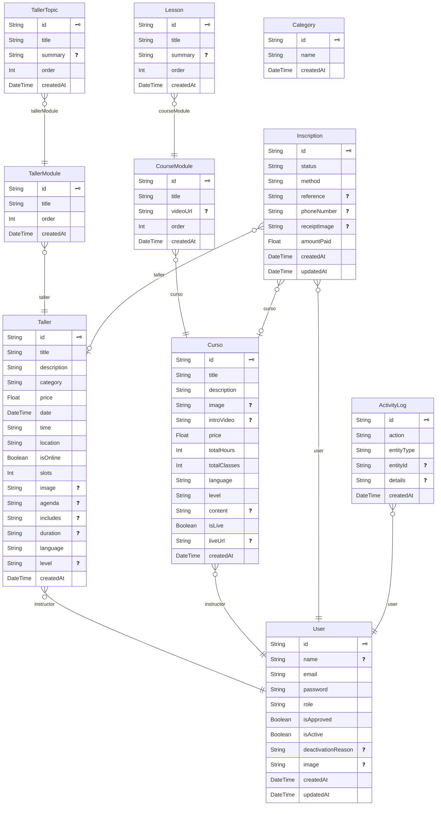

```mermaid
erDiagram

  "User" {
    String id "🗝️"
    String name "❓"
    String email 
    String password 
    String role 
    Boolean isApproved 
    Boolean isActive 
    String deactivationReason "❓"
    String image "❓"
    DateTime createdAt 
    DateTime updatedAt 
    }
  

  "Taller" {
    String id "🗝️"
    String title 
    String description 
    String category 
    Float price 
    DateTime date 
    String time 
    String location 
    Boolean isOnline 
    Int slots 
    String image "❓"
    String agenda "❓"
    String includes "❓"
    String duration "❓"
    String language 
    String level "❓"
    DateTime createdAt 
    }
  

  "TallerModule" {
    String id "🗝️"
    String title 
    Int order 
    DateTime createdAt 
    }
  

  "TallerTopic" {
    String id "🗝️"
    String title 
    String summary "❓"
    Int order 
    DateTime createdAt 
    }
  

  "Curso" {
    String id "🗝️"
    String title 
    String description 
    String image "❓"
    String introVideo "❓"
    Float price 
    Int totalHours 
    Int totalClasses 
    String language 
    String level 
    String content "❓"
    Boolean isLive 
    String liveUrl "❓"
    DateTime createdAt 
    }
  

  "CourseModule" {
    String id "🗝️"
    String title 
    String videoUrl "❓"
    Int order 
    DateTime createdAt 
    }
  

  "Lesson" {
    String id "🗝️"
    String title 
    String summary "❓"
    Int order 
    DateTime createdAt 
    }
  

  "Inscription" {
    String id "🗝️"
    String status 
    String method 
    String reference "❓"
    String phoneNumber "❓"
    String receiptImage "❓"
    Float amountPaid 
    DateTime createdAt 
    DateTime updatedAt 
    }
  

  "Category" {
    String id "🗝️"
    String name 
    DateTime createdAt 
    }
  

  "ActivityLog" {
    String id "🗝️"
    String action 
    String entityType 
    String entityId "❓"
    String details "❓"
    DateTime createdAt 
    }
  
    "Taller" }o--|| "User" : "instructor"
    "TallerModule" }o--|| "Taller" : "taller"
    "TallerTopic" }o--|| "TallerModule" : "tallerModule"
    "Curso" }o--|| "User" : "instructor"
    "CourseModule" }o--|| "Curso" : "curso"
    "Lesson" }o--|| "CourseModule" : "courseModule"
    "Inscription" }o--|o "Curso" : "curso"
    "Inscription" }o--|o "Taller" : "taller"
    "Inscription" }o--|| "User" : "user"
    "ActivityLog" }o--|| "User" : "user"
```
